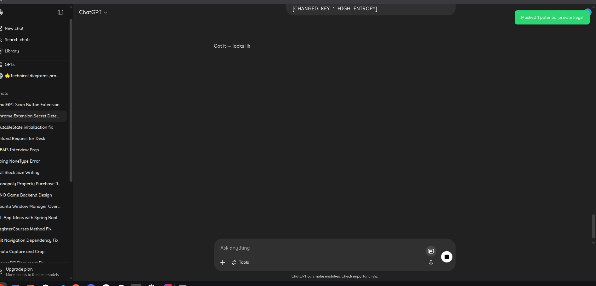
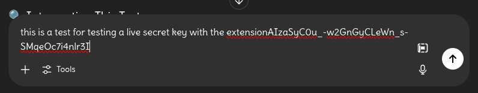
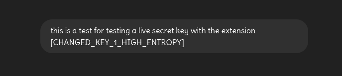

# Key Masker

Key Masker is a chrome extension that maskes your secret keys before prompting it to any GPT


## License

[MIT](https://choosealicense.com/licenses/mit/)


## Authors

- [@Ali Jafar](https://www.github.com/s1lent18)


## Installation

Clone the repository into your system

```bash
  https://github.com/s1lent18/Key-Masker.git
```

or Download the zip File

after downloading or cloning the repository, access your brower and navigate to chrome://extensions/

select the Load unpacked button and in the popup select the project folder

you may have to enable developer options to use the Load unpacked button

after navigate to www.chatgpt.com and the extension will be ready to use 
    
## Screenshots




